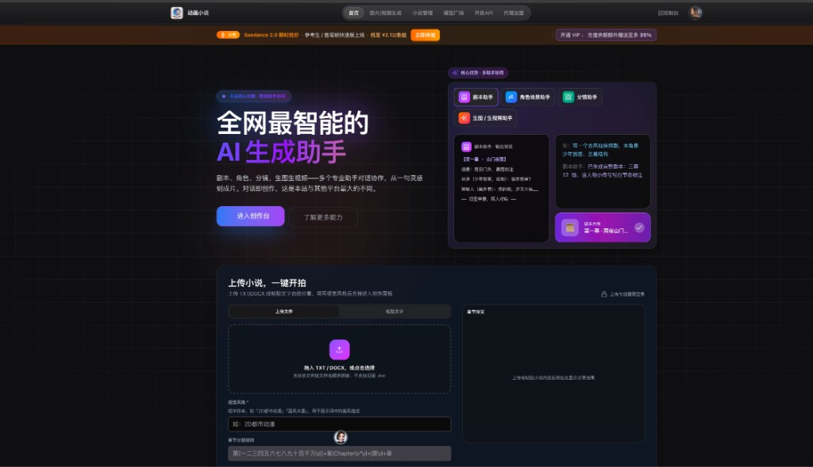

# 动画小说 · AI Drama

> 全网最智能的 AI 生成助手 —— 剧本、角色、分镜、生图生视频，多个专业助手对话协作，从一句灵感到成片。

[访问官网](https://xiaoshuodonghua.com) · [观看使用教程](https://www.bilibili.com/video/BV1Q97W6NEq7/?share_source=copy_web&vd_source=c750bbb64d6a46dc60f3fb736c41e3e0)

---

## 项目简介

**动画小说** 是一站式 AI 动画创作平台，面向小说作者、短剧团队与内容创作者，将文字故事高效转化为可视化的动画作品。平台聚合实时最新最全的生成模型广场，持续接入业界前沿的文生图、图生视频能力，让创作不再受限于工具与流程。

**对话即创作** —— 这是本站与其他平台最大的不同。你不需要在多个工具之间来回切换，只需与专业 AI 助手自然对话，即可完成从灵感到成片的完整链路。

## 核心能力

| 模块 | 说明 |
|------|------|
| **剧本助手** | 理解故事脉络，自动梳理剧情结构，输出可直接拍摄的分场剧本 |
| **角色场景助手** | 提取人物关系与世界观，生成一致的角色设定与场景描述 |
| **分镜助手** | 将剧本拆解为镜头语言，规划画面构图与叙事节奏 |
| **生图 / 生视频助手** | 调用模型广场最新能力，批量产出高质量画面与动态片段 |
| **小说管理** | 上传 TXT / DOCX，自动分集分章，支持自定义视觉风格与章节分割规则 |
| **模型广场** | 实时同步全网主流生成模型，覆盖文生图、图生视频等全场景 |
| **开放 API** | 面向开发者与企业客户，支持能力集成与二次开发 |

## 核心优势

- **多助手协同** —— 剧本、角色、分镜、生图生视频四大助手分工协作，像拥有一个专业制作团队
- **一键开拍** —— 上传小说或粘贴文本，配置视觉风格后即可启动全流程自动化生产
- **模型始终最新** —— 模型广场持续更新，无需自行折腾环境，开箱即用顶尖生成能力
- **低门槛高上限** —— 新手可对话式创作，专业团队可深度定制分镜与风格参数

## 快速开始

1. 前往 [官网](https://xiaoshuodonghua.com) 注册并进入创作台
2. 上传小说文件，或直接在对话中描述你的创作灵感
3. 与剧本、角色、分镜等助手协作，逐步完善作品
4. 在模型广场选择心仪的生图 / 生视频模型，一键出片

新手建议先观看 [动画小说面板使用教程](https://www.bilibili.com/video/BV1Q97W6NEq7/?share_source=copy_web&vd_source=c750bbb64d6a46dc60f3fb736c41e3e0)，快速上手全流程操作。

## 相关链接

- [官网](https://xiaoshuodonghua.com)
- [动画小说面板使用教程](https://www.bilibili.com/video/BV1Q97W6NEq7/?share_source=copy_web&vd_source=c750bbb64d6a46dc60f3fb736c41e3e0)

## License

MIT
